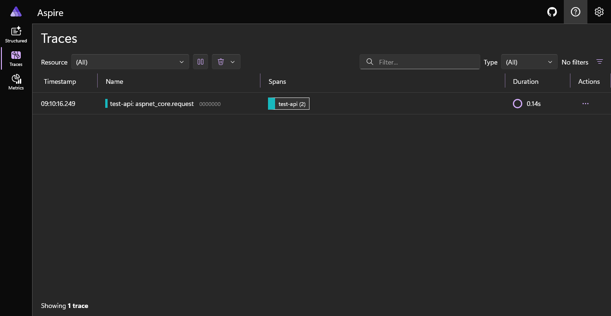
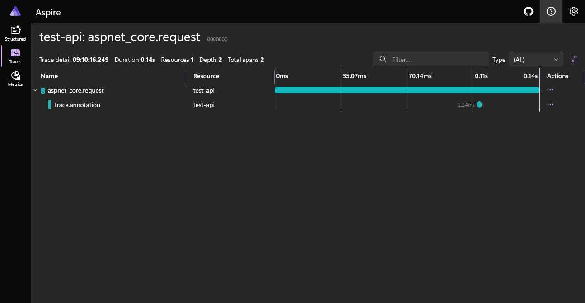

# DataDog Local Traces

Provides a way to view [dd-trace-dotnet](https://github.com/DataDog/dd-trace-dotnet) traces when running locally using the [Aspire Dashboard](https://aspire.dev/)

## Background

We use the DataDog .NET APM Client libraries to send traces and metrics to the DataDog dashboard to monitor performance, but it's useful to be able see these when developing locally. 

Methods can be decorated with the `[Trace]` annotation, and these will show up as child spans

This solution consists of a Docker setup that will run the Aspire dashboard and an OTEL collector, as well as the configuration needed to be able to ship traces locally.

## Usage

Start the Docker images with:
```powershell
docker compose up
```

You will see a log entry with the URl to the dashboard in the Docker output like this:

```powershell
aspire-dashboard  |       Login to the dashboard at http://localhost:18888/login?t=d09d8634c2b18de23478498ced6b946a . The URL may need changes depending on how network access to the container is configured.
```

---

There is an example .NET API in the TestAPI folder. With the addition of the `Datadog.Trace.Bundle` NuGet package, the program is able to send the traces to the dashboard.

The relevant part is the `launchSettings.json` file which sets the following environment variables:
```json
"DD_TRACE_AGENT_URL": "http://localhost:8126",
"DD_TRACE_ENABLED": "true",
"DD_APM_ENABLED": "true",
"CORECLR_ENABLE_PROFILING": "1",
"CORECLR_PROFILER": "{846F5F1C-F9AE-4B07-969E-05C26BC060D8}",
"CORECLR_PROFILER_PATH": "bin\\Debug\\net8.0\\datadog\\win-x64\\Datadog.Trace.ClrProfiler.Native.dll",
"DD_DOTNET_TRACER_HOME": "bin\\Debug\\net8.0\\datadog",
"DD_LOGS_INJECTION": "true",
"DD_RUNTIME_METRICS_ENABLED": "true",
"DD_SERVICE": "test-api",
"DD_ENV": "development"
```

(Note you may need to change the `win-x64` part of the `CORECLE_PROFILER_PATH` depending on your OS)

Start the example API with:
```powershell
cd TestAPI
dotnet run
```

You can then call the `/random` API and see the traces in the Dashboard:





## Todo

- [ ] Add Logging example
- [ ] Add Metrics example (using DogStatsD)